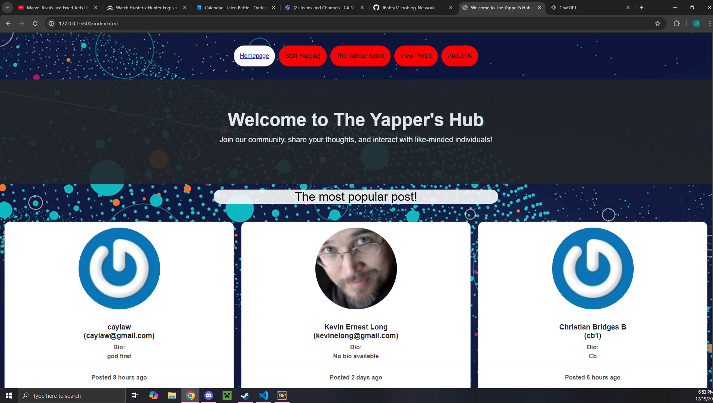
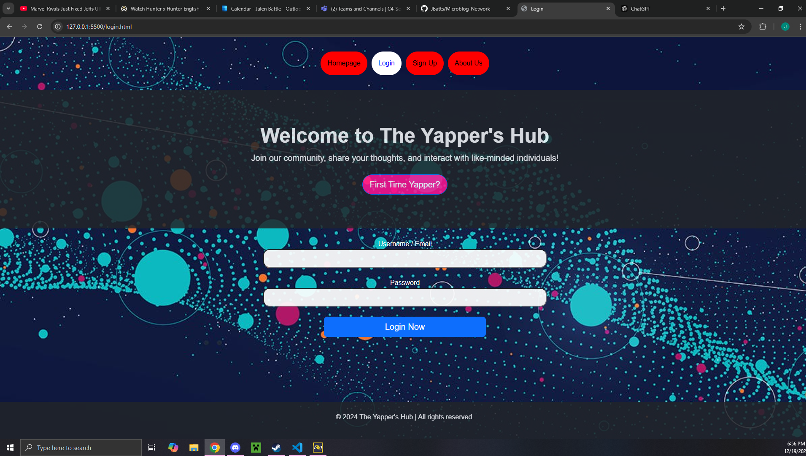
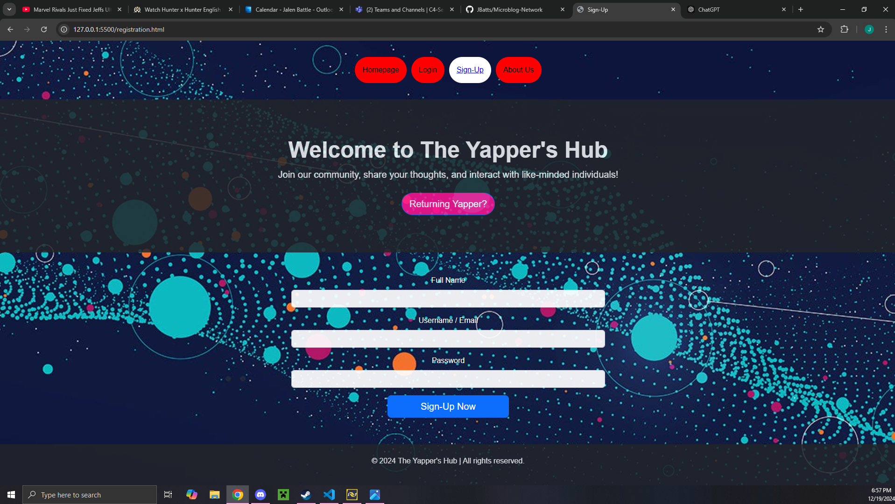
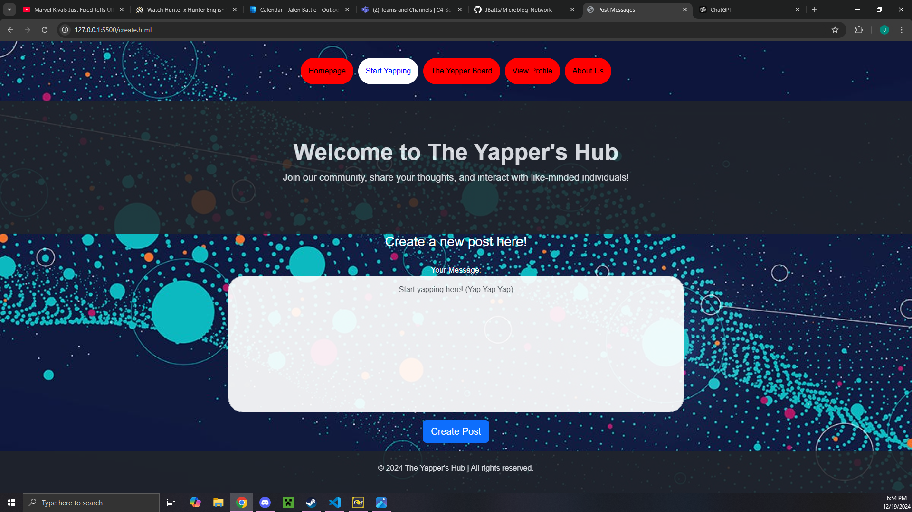
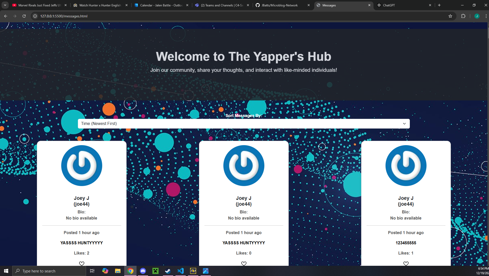
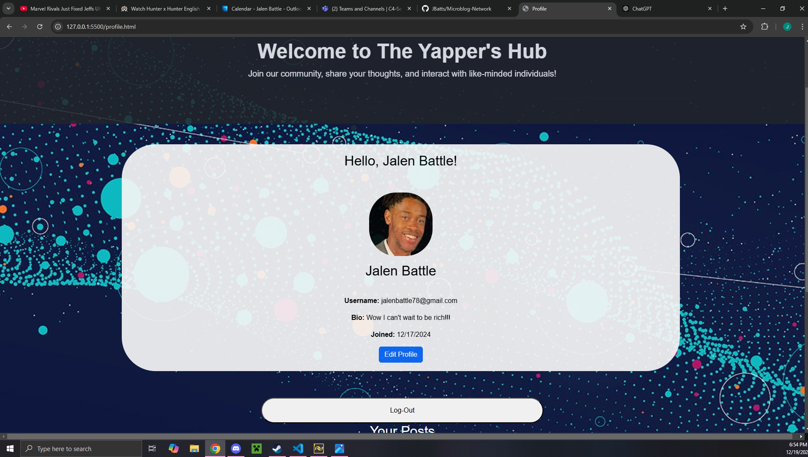
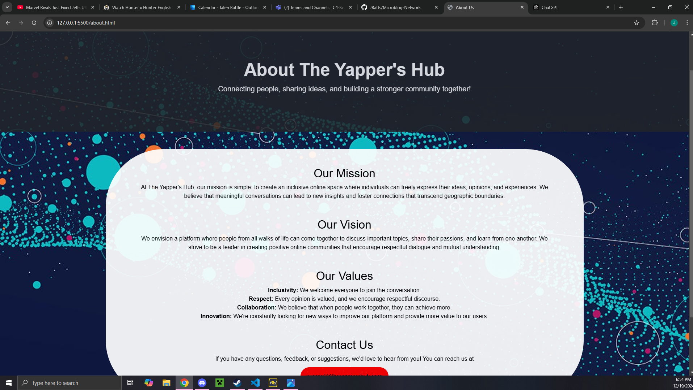

# Microblog Network

Microblog Network is a lightweight, web-based application that allows users to create microblog posts, share updates, and explore a community of posts.

## Screenshots
- 
- 
- 
- 
- 
- 
- 

## Features

- User Authentication:
  - Sign up, login, and secure authentication for all users.
  - Redirect users who are not logged in to the login page.

- Post Management:
  - Create, view, and delete posts.
  - Posts display the author, content, and timestamp.
  - Optional: Like/unlike posts with a counter for likes.

- User Profile:
  - Edit profile (add bio or profile picture via Gravatar integration).
  - Logout functionality.

- Enhanced UI:
  - Bootstrap-powered design.
  - Lightweight and mobile-responsive layout.

## Optional Extra Credit Features

- Sort posts by popularity or author.
- Integrate Gravatar for profile pictures.
- Add a post-like toggle and counters.

## Technologies Used

- Front-end: HTML, CSS, Bootstrap, JavaScript.
- Back-end API: MicroblogLite.
- Tools: GitHub for version control.

## Installation

1. Clone the repository:
   ```bash
   git clone https://github.com/JBatts/Microblog-Network.git
